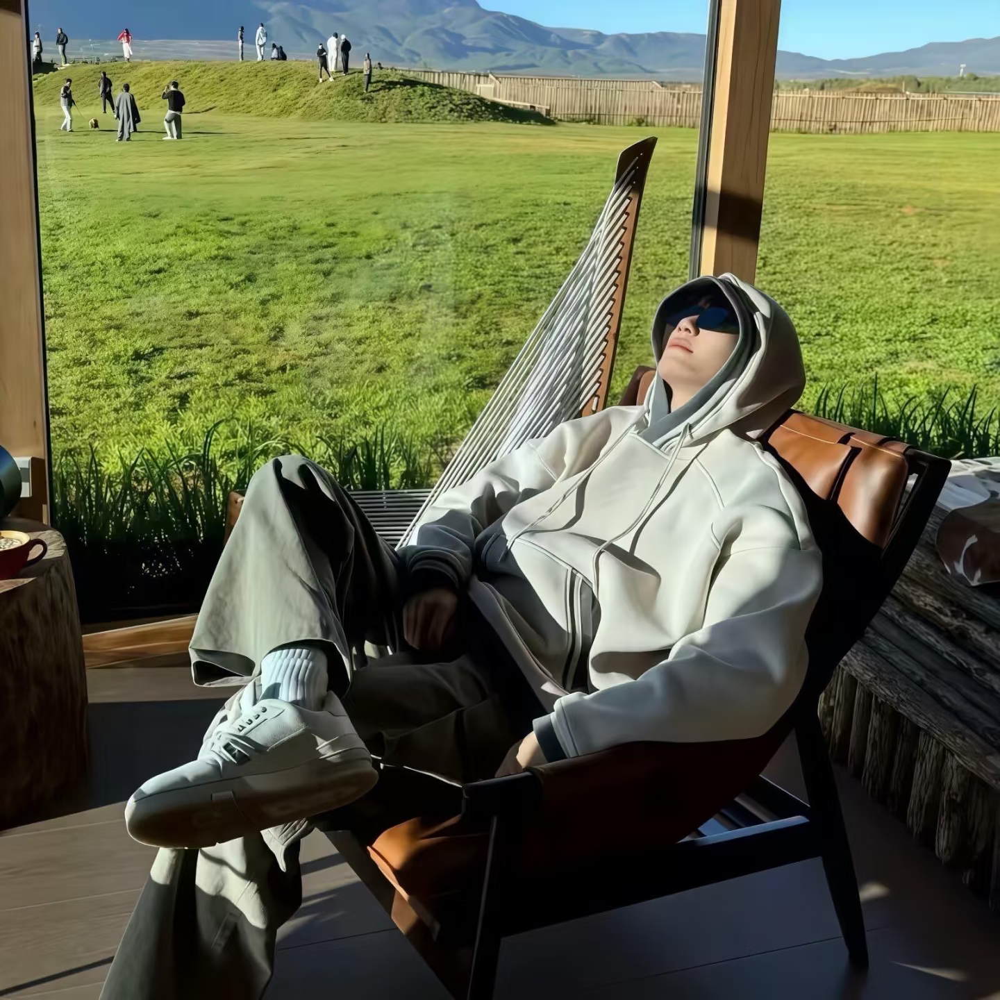

<!DOCTYPE html>
<html lang="zh-CN">

<head>

<meta charset="UTF-8">

<meta name="viewport" content="width=device-width, initial-scale=1.0">

<title>
陈先生 | Live Creator & AI Operator
</title>

<link rel="preconnect" href="https://fonts.googleapis.com">

</head>

<body>

<!-- 粒子背景 -->

<canvas id="particles"></canvas>

<!-- 顶部导航 -->

<header class="nav">

CHEN

<nav>

<a href="#about">
关于
</a>

<a href="#experience">
经历
</a>

<a href="#projects">
作品
</a>

<a href="#contact">
联系
</a>

</nav>

☰

</header>

<!-- HERO首页 -->

<section class="hero">

<h1 class="name">

陈先生

</h1>

<h2 class="role">

Live Creator

 

&

 

AI Operator

</h2>

连接直播生态与人工智能，

 

创造数字内容的新增长方式

直播运营

AI工具

个人IP

<a href="#projects"
class="main-btn">

查看作品

</a>

</section>

<!-- 数据展示 -->

<section class="numbers">

<h3>
3年
</h3>

直播行业经验

<h3>
10万
</h3>

单月最高流水

<h3>
5.5万
</h3>

账号粉丝增长

<h3>
10万
</h3>

创业项目盈利

</section>

<!-- 关于我 -->

<section id="about">

<h2>
About Me
</h2>

我是陈先生，18岁。

  

拥有3年直播行业实战经验，

1年以上团播主播经验。

  

熟悉直播全流程：

主播培养、直播内容设计、

用户互动、流量增长。

  

擅长Kpop、Hiphop舞蹈，

原创编舞以及直播节目效果设计。

  

熟悉抖音、快手、Bigo等平台运营，

并使用AI工具提升内容效率。

</section>

<!-- 技能 -->

<section class="skills-section">

<h2>

Skills

</h2>

Live Operation

Content Growth

AI Tools

IP Building

PS Design

Data Analysis

</section>

<!-- 工作经历 -->

<section id="experience">

<h2>

Experience

</h2>

<h3>

重庆星丹文化传媒有限公司

</h3>

<h4>

主播 & 运营

 

2023.11 - 至今

</h4>

负责团播直播内容输出，

直播间气氛打造以及用户互动。

  

负责账号运营：

 

内容策划

 

流量测试

 

粉丝增长

 

用户维护

  

业绩：

 

单月最高流水 ¥100,000

 

月均流水 ¥30,000

 

单日最高流水 ¥8,000

<h3>

自媒体账号运营

</h3>

<h4>

2023

</h4>

独立完成账号定位、

内容策划、拍摄、剪辑、

发布以及数据分析。

  

2个月：

 

账号增长至5.5万粉丝。

<h3>

信息差创业项目

</h3>

<h4>

2022

</h4>

发现市场机会，

独立完成项目运营。

  

2个月盈利近 ¥100,000。

</section>

<!-- 项目作品 -->

<section id="projects">

<h2>

Featured Projects

</h2>

<!-- 项目1 -->

LIVE GROWTH

直播运营

<h3>

直播增长运营系统

</h3>

从账号定位、

内容设计、

直播运营到商业转化，

打造完整增长体系。

¥100,000

 

最高月流水

<button class="detail-btn">

VIEW CASE

</button>

<h4>

项目职责

</h4>

主播运营

 

直播策划

 

数据分析

 

用户增长

<h4>

成果

</h4>

单月最高流水10万元。

<!-- 项目2 -->

BIGO LIVE

海外直播

<h3>

海外直播生态运营

</h3>

研究海外直播平台玩法，

主播培养和用户增长。

GLOBAL

 

LIVE OPERATION

<button class="detail-btn">

VIEW CASE

</button>

<h4>

平台

</h4>

Bigo Live

<h4>

能力

</h4>

主播管理

 

活动策划

 

直播运营

 

用户增长

<!-- 项目3 -->

CREATOR

个人IP

<h3>

自媒体增长项目

</h3>

从0开始打造账号，

完成内容增长和粉丝积累。

55K+

 

粉丝

<button class="detail-btn">

VIEW CASE

</button>

<h4>

负责内容

</h4>

账号定位

 

选题策划

 

视频制作

 

数据复盘

<h4>

成果

</h4>

2个月达到5.5万粉丝。

</section>

<!-- 联系方式 -->

<section id="contact">

<h2>

Contact

</h2>

陈先生

📞 18198492700

主播 / 直播运营 / 新媒体运营

揭阳 · 广州 · 深圳 · 杭州

</section>

<footer>

© 2026 Chen Portfolio

</footer>

<!-- 第3部分CSS和JS会继续放这里 -->

<!-- ESSPSEEK AI助手 -->

<button id="ai-btn">🤖 ESSPSEEK</button>

ESSPSEEK AI运营助手

AI：你好，我是你的AI运营助手。

<input id="ai-text" placeholder="输入问题..."/><button onclick="askESSPSEEK()">发送</button>

</body>

</html>
